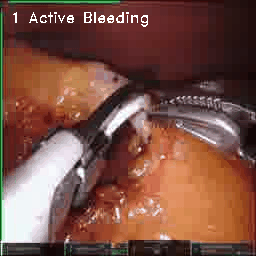
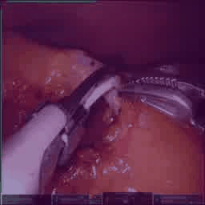
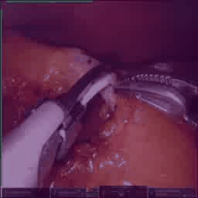

<center> <h1>Amplifying Action-context Greater: Image segmentation-guided Active Bleeding Localization in intraoperative gastrectomy</h1> </center>


In these supplementary materials, we follow the anonymization rule.


### Proposed Active Bleeding Framework
 The schematic diagram of active bleeding framework using our proposed model AMAGI.

 Proposed fusion-based active bleeding recognition model AMAGI.


### GradCAM Visualization
Example gifs

| Data Type | frames                | Fast Pathway (SlowFast)                     | Fast Pathway (AMAGI)                     | Fusion Layer (AMAGI)                     |
|:---------:| ------------------------------------------ | ------------------------------------------ | ------------------------------------------ | ------------------------------------------ |
| Ex1       |   |   |  |  |
| Ex2       |   |   |  |  |


## Surgical Analysis Index
Comparisons of SlowFast and AMAGI on blood count and duration for each 30 test cases.

### Split 1


### Split2 


### Split 3


## Code with pretrained model
Here is our modified version of [mmaction2](https://github.com/amagi-project/mmaction2) for active bleeding framework.

1. Modified implementation of fusion architecture is in
```bash
'./mmaction/models/{ segmentors | heads | backbones }'
```

2. train and inference scripts are in
```bash
'./my_tools/{ amagi_train.sh | amagi_inf.sh }' 
```

3. Pretrained semantic segmentation model and fusion model AMAGI are publicly available in our google drive [here](https://drive.google.com/drive/folders/1dGLRZIEo-kiZZrtXV4XdfdCuEYdsysGb?usp=sharing).