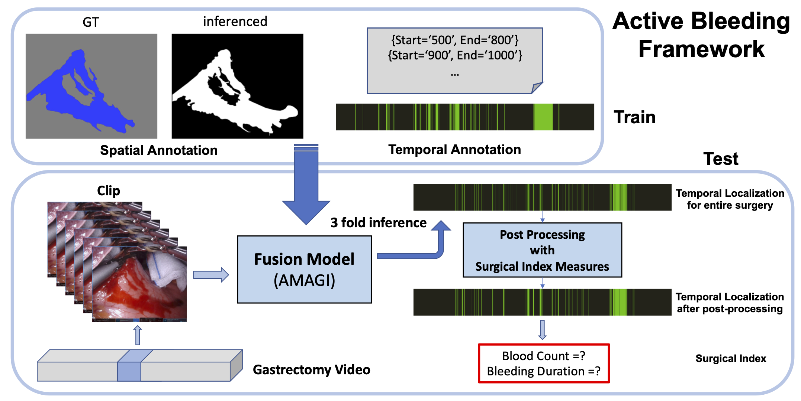
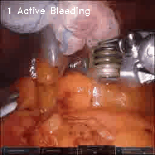
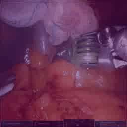
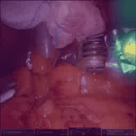
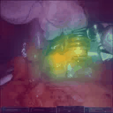
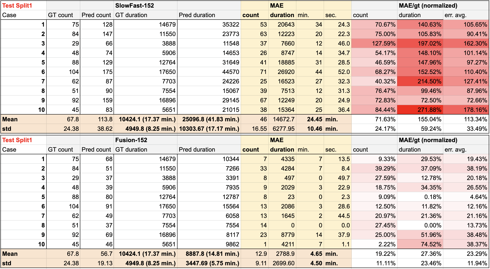
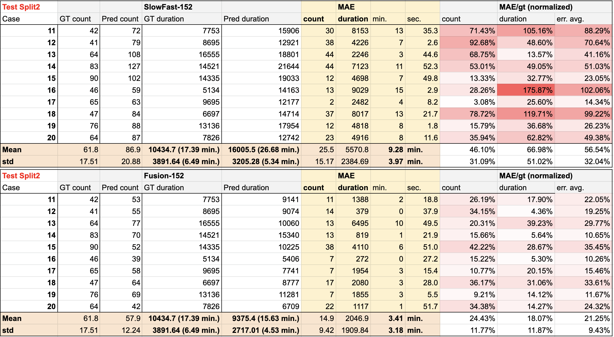
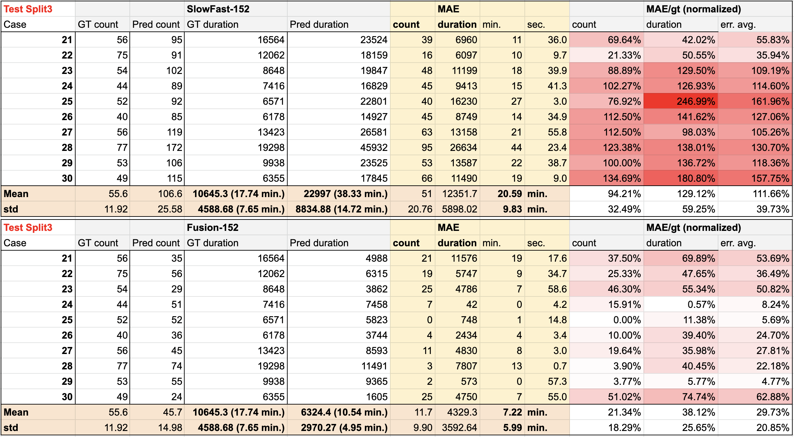

 <h1>Amplifying Action-context Greater: Image segmentation-guided Active Bleeding Localization in intraoperative gastrectomy</h1> 

 The schematic diagram of active bleeding framework using our proposed model AMAGI

 Proposed fusion-based active bleeding recognition model AMAGI.

### GradCAM Visualization
Example gifs

| Data Type | frames                | Fast Pathway (SlowFast)                     | Fast Pathway (AMAGI)                     | Fusion Layer (AMAGI)                     |
|:---------:| ----------------------- | ------------------------ | ------------------------- |
| Ex1       |   |   |  |  |

## Surgical Analysis Index
Comparisons of SlowFast and AMAGI on blood count and duration for each 30 test cases.

### Split 1

### Split2 

### Split 3

